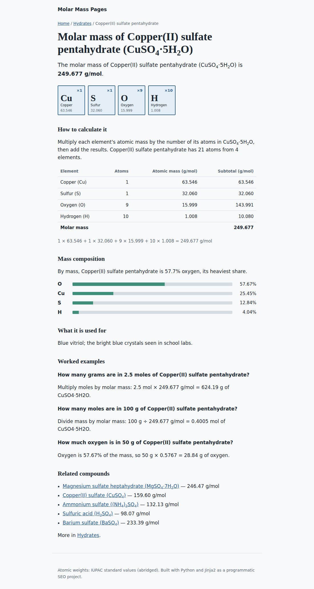

# Molar Mass Pages: a programmatic SEO project

A Python static site generator that turns two small data files into **81 indexable pages**: 51 "molar mass of [compound]" pages, 22 element hubs, 7 category hubs and a home page. Every page carries technical SEO built in, and a quality gate blocks the build if any page comes out thin, duplicated or orphaned.

**Live site:** https://hassanreschem-1616.github.io/molar-mass-pages/



## Why this keyword pattern

Searches like *molar mass of NaCl*, *molar mass of glucose* and *molar mass of H2SO4* follow one repeatable pattern, `molar mass of {compound}`. Thousands of students search it every exam season. That makes it a good fit for programmatic SEO:

- **One head term, many modifiers.** Each compound is a long-tail query with clear intent: the user wants a number and the working behind it.
- **Unique value on every page.** The content is calculated, not spun. Each page shows its own element breakdown, mass percentages and worked examples, so no two pages say the same thing.
- **A natural hub structure.** Compounds group into categories (acids, salts, oxides) and link to every element they contain. This creates a dense internal-link graph without any forced linking.

## How it works

```
data/compounds.csv  ─┐
data/elements.json  ─┼─> src/chem.py   (parse formula, compute molar mass and % composition)
                     │
templates/*.html  ───┴─> src/build.py  (render pages, links, schema, sitemap)
                                │
                                ├─> dist/         static site
                                └─> quality gate  (fail the build on SEO problems)
```

| Page type | URL pattern | Count | Targets |
| --- | --- | --- | --- |
| Compound | `/molar-mass-of-{compound}/` | 51 | "molar mass of sodium chloride" |
| Element hub | `/element/{symbol}/` | 22 | "compounds containing sodium", "% iron in Fe2O3" |
| Category hub | `/category/{category}/` | 7 | "molar mass of acids" |
| Home | `/` | 1 | Index of every compound, category and element |

## SEO features

- **Answer first.** The first sentence gives the molar mass, which helps the page win featured snippets.
- **Unique titles and meta descriptions** generated from the data. Both are checked for duplicates and length on every build.
- **Self-referencing canonical tags** and Open Graph tags on every page.
- **Structured data:** `FAQPage` (three calculated worked examples per compound), `BreadcrumbList` on every page, and `WebSite` on the home page.
- **Internal linking at scale:** breadcrumbs, element tiles that link to element hubs, five related compounds per page (ranked by shared elements and category), and sibling hub links.
- **XML sitemap and robots.txt** generated on every build.
- **Fast by default:** static HTML, a single CSS file, no JavaScript, and a layout that is mobile-friendly and dark-mode aware.

## Quality gate

`build.py` checks every page before it publishes and exits with an error if any check fails. It also writes the results to `quality-report.md`.

| Check | Rule | Current result |
| --- | --- | --- |
| Duplicate titles and descriptions | none allowed | 0 |
| Meta description length | 160 characters or fewer | pass |
| Thin content | 180 or more words per compound page | 221–304 words |
| Internal links | 6 or more per compound page | pass |
| Orphan pages | every page needs an inbound link | 4 or more inbound links per page |
| Near-duplicates | Jaccard similarity (5-word shingles) of 0.55 or less | highest pair 0.29 |

## Run it locally

```bash
pip install -r requirements.txt
python src/build.py
python -m http.server -d dist 8000   # open http://localhost:8000
```

To add pages, add rows to `data/compounds.csv` and rebuild. The gate tells you if the new pages are too thin or too similar to existing ones.

## Deployment

Each push to `main` triggers `.github/workflows/deploy.yml`. The workflow builds the site, runs the quality gate, and publishes `dist/` to GitHub Pages. If the gate fails, nothing is deployed.

## Results

<!-- Update this after the site has been live for a few weeks -->
- Pages submitted in Search Console: _TBD_
- Pages indexed: _TBD_
- Impressions and clicks in the first 30 days: _TBD_

## What I'd do next

- Grow the dataset to 500+ compounds from a public source (for example PubChem), with the quality gate keeping standards up.
- Add an interactive molar mass calculator for formulas that don't have a page yet.
- Track which modifiers earn impressions in Search Console and prioritise similar compounds.

## Tech

Python 3, Jinja2, GitHub Actions, GitHub Pages. Atomic weights are abridged IUPAC standard values.

---

Built by **Hassan Rafiq**, SEO specialist · [LinkedIn](https://www.linkedin.com/in/hassan-rafiq933)
